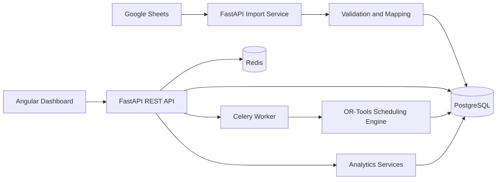

# Workforce Automation Analytics

Full-stack workforce analytics and scheduling platform for importing employee availability, analyzing weekly coverage, and generating retail shift schedules.

This project is being built as a realistic workforce planning system: employees can maintain availability in Google Sheets, the backend imports and validates that data, and the scheduling engine will produce weekly shift plans that respect staffing demand, employee availability, and leave periods.

## Project Status

In development. The current foundation includes:

- FastAPI backend with versioned API routing and health checks
- Celery worker foundation using Redis as broker/result backend
- PostgreSQL and Redis services through Docker Compose
- Angular dashboard shell with routing and an operations overview
- GitHub Actions workflows for backend, frontend, and Compose validation
- Retail-focused SQLAlchemy data model with Alembic migration tooling
- Architecture documentation for Google Sheets imports and scheduling logic

Upcoming work will add Google Sheets ingestion, weekly availability analysis, schedule generation, dashboard views, and end-to-end tests.

## Why This Project Exists

Workforce scheduling often starts in spreadsheets, but quickly becomes difficult to manage when availability, vacations, sick leaves, and staffing demand all interact.

This platform is designed to bridge that gap:

- Keep Google Sheets as a simple data-entry surface for availability.
- Validate and normalize planning data in a backend system.
- Store clean operational data in PostgreSQL.
- Generate weekly schedules from clean availability and demand data.
- Show availability analysis and generated schedules in a dashboard.

## Planned Capabilities

- Import employee availability from Google Sheets.
- Manage employees, availability, vacations, sick leaves, and shift demand.
- Generate schedules using Google OR-Tools.
- Model hard constraints such as unavailability and leave periods.
- Analyze weekly availability and shift coverage.
- Run backend, worker, database, cache, and frontend services locally with Docker.

## Architecture



The scheduling engine will not read directly from Google Sheets. Google Sheets is treated as an input source; PostgreSQL is the validated source of truth used by the backend, analytics, and optimization jobs.

## Tech Stack

| Area | Technology |
| --- | --- |
| Backend | Python, FastAPI, Pydantic |
| API | REST, versioned routes |
| Database | PostgreSQL |
| Background jobs | Celery, Redis |
| Optimization | Google OR-Tools |
| Frontend | Angular, TypeScript |
| Testing | pytest, Angular build/type checks, planned Playwright |
| DevOps | Docker Compose, GitHub Actions |
| Data source | Google Sheets API |

## Repository Structure

```text
apps/
  backend/      FastAPI API, settings, schemas, workers, tests
  frontend/     Angular dashboard shell and feature modules
infra/          Docker Compose and infrastructure docs
docs/           Architecture, import, and development workflow notes
.github/        GitHub Actions workflows
```

Database design notes and the ER diagram live in [docs/database-design.md](docs/database-design.md).

## Local Development

Create a local environment file:

```powershell
Copy-Item .env.example .env
```

Fill in local-only database values:

```env
POSTGRES_DB=workforce_analytics
POSTGRES_USER=local_workforce_user
POSTGRES_PASSWORD=local_workforce_password
```

Start the full local stack:

```powershell
docker compose --env-file .env -f infra/docker-compose.yml up --build
```

Useful local URLs:

- Frontend: http://localhost:4200
- Backend health: http://localhost:8000/api/v1/health

Check the Celery worker through Redis:

```powershell
docker compose --env-file .env -f infra/docker-compose.yml exec backend python -c "from app.workers.tasks.health import ping; print(ping.delay().get(timeout=10))"
```

Stop the stack:

```powershell
docker compose --env-file .env -f infra/docker-compose.yml down
```

## Backend Checks

```powershell
Push-Location apps/backend
uv sync --frozen --group dev
uv run --frozen --group dev ruff check app tests
uv run --frozen --group dev pytest
Pop-Location
```

## Frontend Checks

```powershell
Push-Location apps/frontend
npm ci
npm run build
npm exec tsc -- --project tsconfig.spec.json --noEmit
Pop-Location
```

## CI

GitHub Actions currently runs:

- Backend linting and tests with `uv`, `ruff`, and `pytest`
- Frontend dependency install, Angular build, and spec type-checking
- Docker Compose configuration validation

Browser-based end-to-end tests are planned for a later phase after the core dashboard workflows exist.

## Development Workflow

The project is being built in small, reviewable branches:

1. Backend foundation
2. Infrastructure and Docker Compose
3. Celery worker foundation
4. Angular frontend foundation
5. CI foundation
6. Core data model
7. Google Sheets import
8. Scheduling engine
9. Analytics dashboard
10. End-to-end testing

This keeps each pull request focused and makes the system easier to review as it grows.
