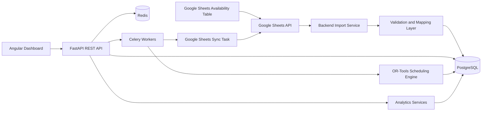

# Architecture

## Core Principle

Google Sheets is the external input source for availability data. PostgreSQL is the validated operational source of truth used by the API, analytics, and scheduler.

The scheduling engine should not read directly from Google Sheets. It receives normalized input assembled by the backend from validated database records.

## System View

## Backend Boundaries

- `api`: HTTP routes and request/response boundaries.
- `schemas`: Pydantic input/output contracts.
- `services`: Application use cases and orchestration.
- `repositories`: Database access abstractions.
- `integrations`: External systems such as Google Sheets.
- `scheduling`: OR-Tools input building, constraints, objectives, solving, and result mapping.
- `workers`: Celery configuration and background tasks.
- `db`: SQLAlchemy models, sessions, and migrations.

## Primary Domains

- Employees
- Availability records
- Absences, including vacations and sick leave
- Shift templates
- Shift demand
- Scheduling runs
- Scheduled shifts

Deferred domains:

- Google Sheet source management
- Import history and detailed validation reporting
- Advanced scheduling diagnostics
- Workload history and analytics
