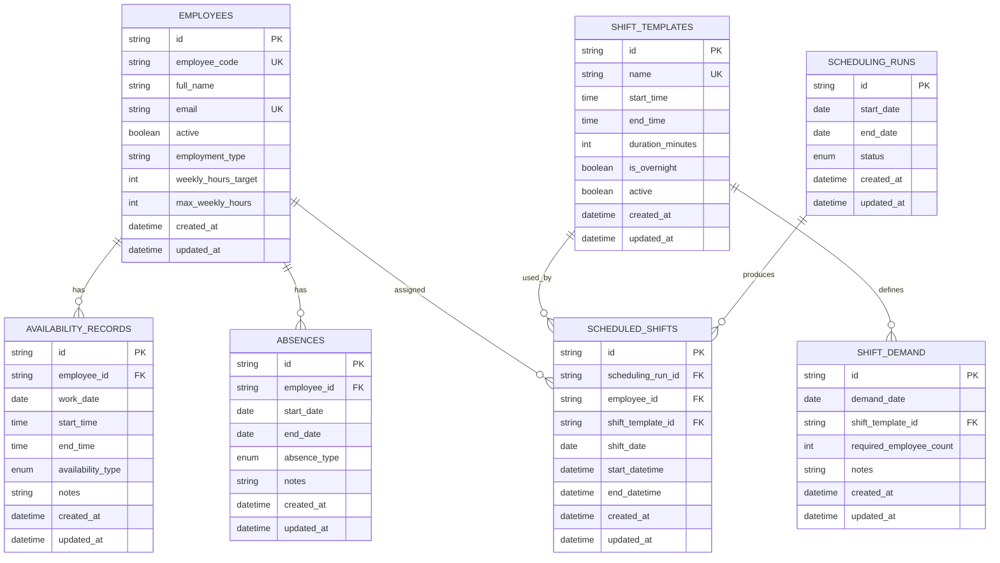

# Database Design

## Scope

The first database model is intentionally small. The MVP should prove the core product loop:

```text
Google Sheet -> PostgreSQL -> availability analysis -> weekly schedule generation
```

That means the schema only stores the data we need to import employee availability, track absences, define staffing demand, and save generated schedules.

Later phases can add audit trails, detailed validation reporting, advanced scheduling diagnostics, workload history, and richer analytics.

## Database Diagram



## Core Entities

### Employees

Stores the people who can be scheduled.

Important fields:

- `employee_code`: stable human-friendly identifier used by Google Sheets imports
- `full_name`
- `email`
- `active`
- `employment_type`
- `weekly_hours_target`
- `max_weekly_hours`

The internal `id` is used for database relationships. `employee_code` is used to match spreadsheet rows to employees.

### Availability Records

Stores employee availability by date and optional time window.

This supports both full-day unavailability and partial-day availability windows:

```text
employee_code | work_date  | start_time | end_time | availability_type
E001          | 2026-06-01 | 08:00      | 16:00    | available
E002          | 2026-06-01 |            |          | unavailable
```

### Absences

Stores vacation, sick leave, training, and other absence periods.

Absences are modeled separately from availability because they block scheduling across a date range.

### Shift Templates

Defines reusable shift patterns:

```text
Morning | 08:00 | 16:00
Evening | 16:00 | 22:00
Night   | 22:00 | 06:00
```

### Shift Demand

Stores how many retail employees are needed for a date and shift template.

The MVP uses `required_employee_count` only. Role-specific or capability-specific demand can be added later.

### Scheduling Runs

Represents one weekly schedule generation attempt.

The run stores the date range and status so generated shifts can be grouped together.

### Scheduled Shifts

Stores the assignments produced by a scheduling run.

Each row connects:

- one scheduling run
- one employee
- one shift template
- one shift date
- concrete start and end datetimes

## MVP Tables

```text
employees
availability_records
absences
shift_templates
shift_demand
scheduling_runs
scheduled_shifts
```

## Deferred Scope

Detailed import tracking, advanced solver diagnostics, employee capability modeling, and historical workload analytics are intentionally deferred until the basic import, analysis, and weekly scheduling flow is working.

## Migration Tooling

Alembic is configured in `apps/backend/alembic.ini`, and the initial MVP schema lives in `apps/backend/app/db/migrations/versions`.

Migration files should be generated from the SQLAlchemy metadata in `app.db.models`.

## Model Implementation Style

The model files intentionally use simple SQLAlchemy column definitions:

```python
employee_id = Column(String(36), ForeignKey("employees.id"), nullable=False)
```

For the MVP, relationships such as `employee.availability_records` are not defined in the ORM models yet. Foreign keys already describe the database structure, and explicit queries will be easier to understand while the project is still small.

ORM relationships can be added later if they make API or scheduling queries easier.
